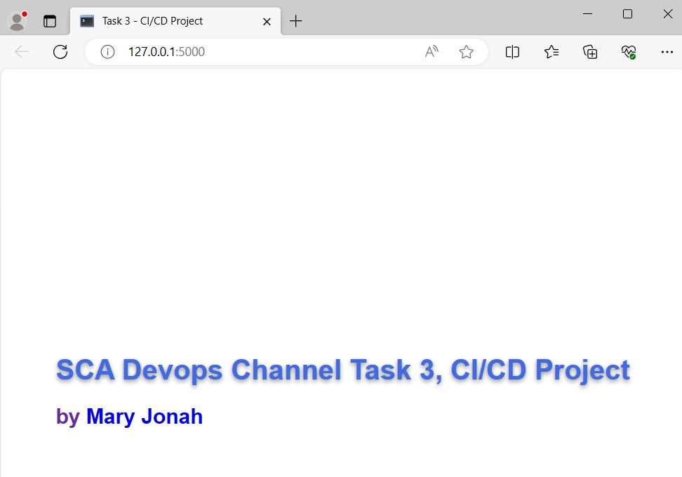

## CI/CD for a Simple Flask API

### Technologies: 
- Flask
- Docker
- Github Actions

### Setup
- [GitHub Actions](../.github/workflows/workflow.yml):  
This file ensures that a raised pull request can only be merged to the **master branch** when the steps listed are completed successfully.  
In summary it installs flask and pytest, runs the test, builds an image of the flask app using the steps in the [Dockerfile](./Dockerfile) and pushes the created image to my DockerHub repository

- [Dockerfile](./Dockerfile):  
This file lists the various steps needed to containerise the flask app.  
It creates a container with Python 3.10, installs flask dependency listed in [requirements.txt](./requirements.txt), copies the application code, exposes port 5000 for access, and runs the Python application.

### How to run the application
- Ensure Docker is installed and is running
- Pull the image using the command  
 ``docker pull jonahmary17/sca-ci-cd-project``
- Run the app with the command  
`` docker run -p 5000:5000 jonahmary17/sca-ci-cd-project``
- Click on the provided IP address to view the webpage  
